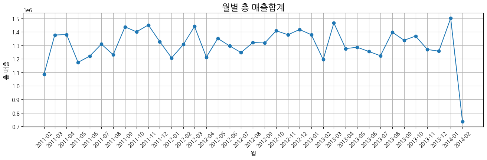
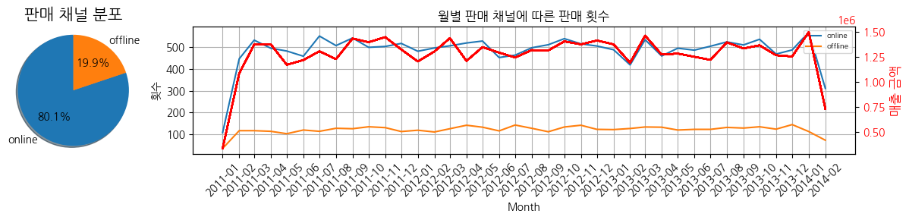
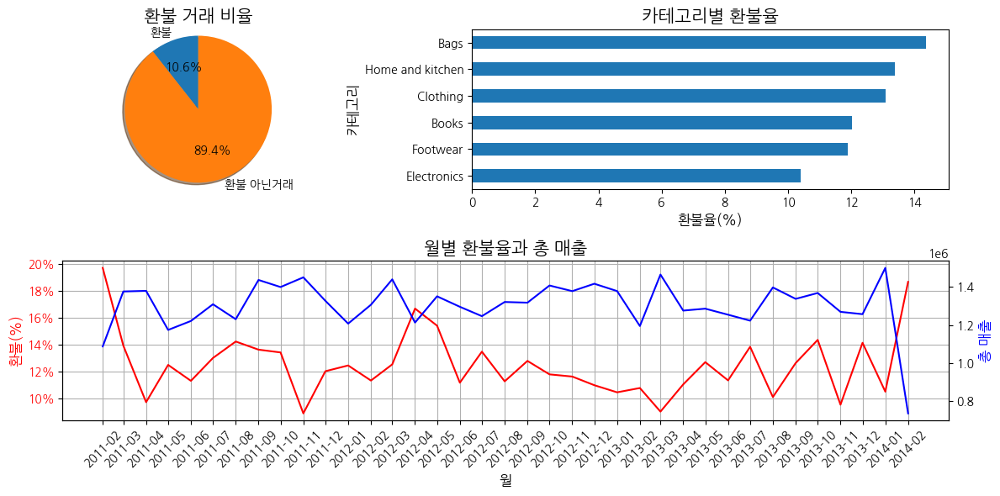
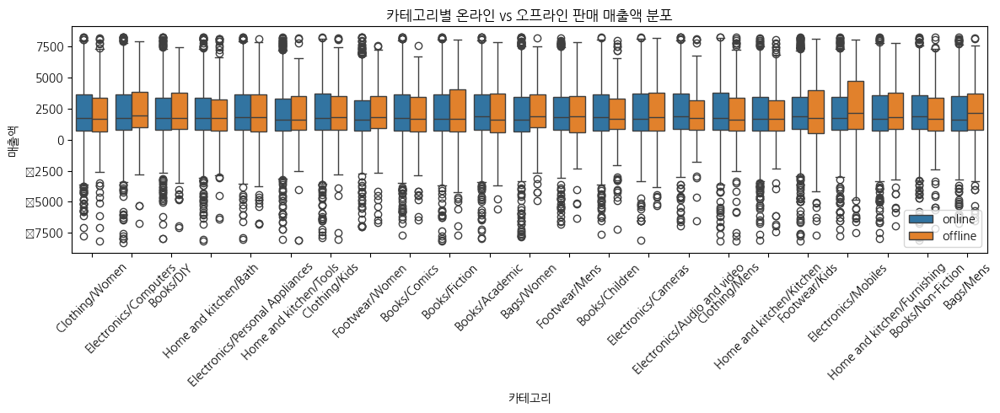
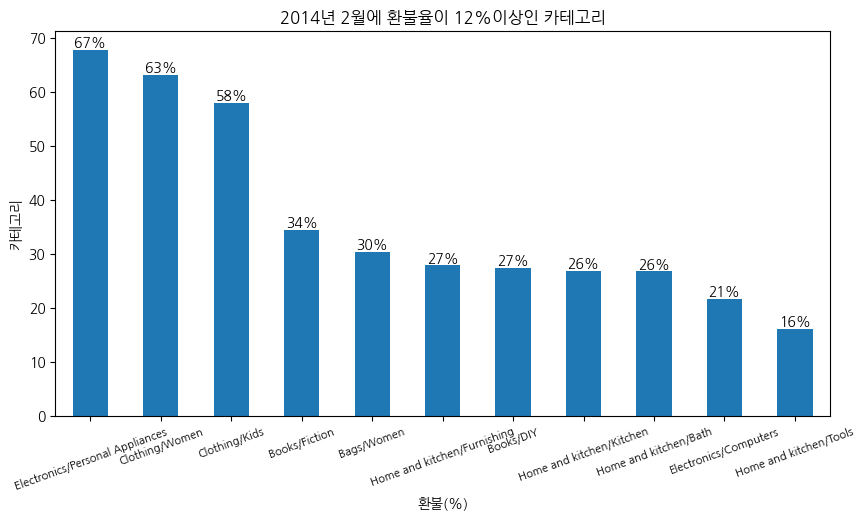
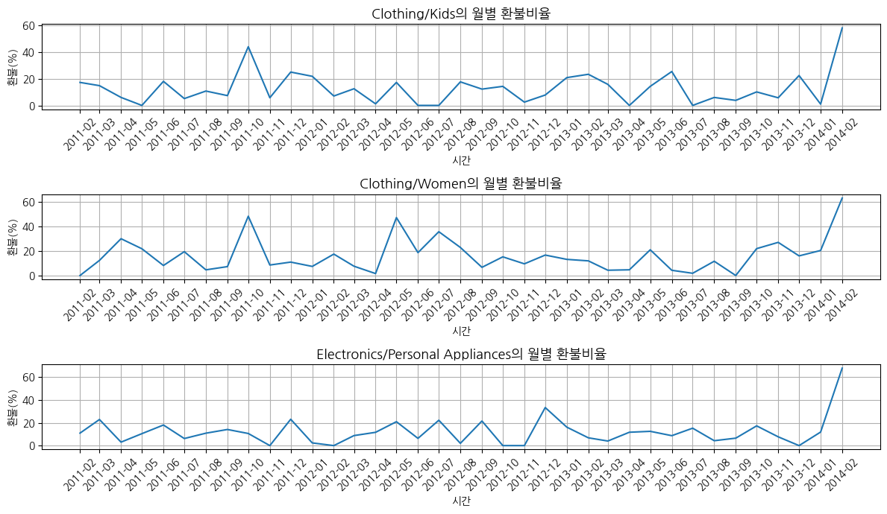

# marketing_project
A/B 테스트와 t-test

매출 관점에서 카테고리별 매출 성장 방안 분석
==============

요약
--------------------------------------
1. 기본 정보
- 개인 프로젝트(기여도 100%)
***
2. 프로젝트 진행 배경
- 커머스 데이터를 할용한 분석 경험을 쌓아보고자 진행하였습니다.
- 대시보드를 활용하여 분석을 실시해보고자 진행하였습니다
- a/b테스트를 배우고 이를 활용해보기 위해 실시했습니다.
***
3. 데이터셋
- Customer.csv : 고객의 인적 정보를 담고 있는 데이터
  - customer_id, DOB, Gender, city_code
- Transactions.csv : 거래 내역 데이터
  - transaction_id, cust_id, tran_date, prod_sub_cat_code, prod_cat_code, Qty, Rate, Tax, total_amt, Store_type
- prod_cat_info : 카테고리 코드/명칭 데이터
  - prod_cat_code, prod_cat, prod_sub_cat_code, prod_subcat

상세
--------
***
### 1. 문제 정의
- 2014년 2월의 총 매출액이 하락하여 기업에 큰 타격을 입었습니다. 
- 3월에 총 매출이 다시 인상하지 않으면 기업은 감당할 수 없는 위험이 다가올 것으로 보입니다. 
- 매출을 인상시키기 위해 카테고리별로 영향을 끼치는 요인을 찾아보고 분석하여 다음 달 매출을 증가시키기 위한 방안을 카테고리별로 제안하기 위해 분석을 진행했습니다.
- 2014년 2월 총 매출이 2014년 1월 총 매출에 비해 50% 가까이 떨어진 것을 알 수 있다.

-------

### 3. EDA
###### 1. 거래 채널에 따른 데이터 탐색

- 전체 거래중 80%가 온라인으로 이루어진 거래이다. 온라인 거래의 비중이 높다
  - 온라인 = Teleshop, e-shop, MBR
  - 오프라인 = Flagship store
- 온라인의 판매량의 비중이 높고 변동도 심하다. 따라서 온라인 판매량의 변동에 따라 매출이 변동된다는 것을 알 수 있다.
----
###### 2. 환불 탐색

- 환불은 전체 거래에서 10%를 차지하고 있다.
- 가방과 가정용품, 옷 카테고리의 환불율이 높은 것을 알 수 있다.
- 환불율과 총 매출액의 상관계수(-0.6)는 음의 상관관계를 가지고 있는걸 확인했습니다.
  - 환불율이 높으면 매출은 감소하고 환불율이 낮으면 매출은 증가한다

----

### 4. 가설 세우기
##### 1. 온라인 판매가 오프라인보다 평균 판매 금액이 높아서 온라인 판매의 부진이 매출에 영향을 끼친것이 아닐까?
- 이유 
  1. 온라인의 경우 물품을 집에서 수령하기 때문에 물품 무게의 제한이 없다.
  2. 온라인의 경우 GBR과 같이 품묵 노출이 유리할 것이다.
  3. 오프라인 판매보다 물품 판매에 투자되는 비용이 저렴하여 오프라인보다 물품 가격에 경쟁력이 생긴다.
- 비교를 지표 설정
  - 비교 지표 : 카테고리별 온라인 판매 vs 카테고리별 오프라인 판매
  - 관심 지표 : 판매 채널간의 매출 평균
##### 2. 구매한 물품에 만족하지 못한 경우가 많아 매출이 감소한 것이 아닐까?
- 이유
  1. 환불율과 매출 금액의 총 합계와의 상관계수는(-0.6) 음의 상관계수를 가지고 있었다.
  2. 구매했던 물품이 불만족스러울 경우 구매자는 환불을 진행하게 된다
  - KPI(불만족지수) : 환불율 (환불된 건수 / 총 거래 건수) × 100
---------

### 5. 분석
##### 1. 온라인 판매가 오프라인보다 평균 판매 금액이 높아서 온라인 판매의 부진이 매출에 영향을 끼친것이 아닐까?
- 가설검정 (t검정)
  - 비교를 통해 온라인과 오프라인의 경쟁력 비교를 위해 통계적 기법인 t검정을 실시했습니다.
    - 귀무가설 : 오프라인 평균 매출 = 온라인 평균 매출
    - 대립가설 : 오프라인 평균 매출 != 온라인 평균 매출
  - 검정 결과 모든 카테고리에서 유의수준(0.05)보다 작은 p값이 존재하지 않았습니다.
  - 오프라인과 온라인의 평균 매출이 같은 것을 의미하고 이는 온라인이 오프라인보다 경쟁력이 있다고 판단할 수 없습니다.
  

- 박스플롯으로 시각화하여 평균 매출을 비교해 보아도 두드러진 차이를 보이는 카테고리는 보이지 않습니다.
- 다만 환불로 인한 마이너스 금액 분포 비율이 온라인보다 오프라인이 더 많은 카테고리가 존재합니다.
##### 2. 구매한 물품에 만족하지 못한 경우가 많아 매출이 감소한 것이 아닐까?

- 환불율이 13%이상인 카테고리들을 추려냈습니다
- 아동 의류와 여성 의류, 개인 가전 제품은 절반이 넘는 구매자들이 해당 카테고리에 대해 불만족스러웠다고 판단할 수 있습니다.

- 해당 카테고리들의 월별 환불율을 확인해본 결과 저번달(2014년 2월)에만 환불율이 급증했습니다.

----------

### 6. 결론
- 카테고리별 온라인과 오프라인의 평균 매출이 통계적으로 차이가 없지만 온라인 판매의 점유율이 80%로 매우 높습니다. 이를 이용하여 온라인 판매를 성장시키면 오프라인보다 평균 매출이 증가하게 되고 이는 총 매출의 증가를 야기할 것입니다. 
  - 온라인 평균 매출 증가시키는 방안
    - 온라인 일정 금액 이상 구매시 할인 쿠폰 증정 : 이는 오프라인 매장과 독립적으로 매출을 증가시키는 반면에 고객 입장에서는 할인을 받기 때문에 서로에게 좋은 마케팅 전략 입니다.
- 의류의 경우 환불의 원인이 고객의 불만족 말고도 맞지 않은 사이즈, 옷의 재질 등 다른 이유들이 존재하지만 이를 고려해도 58%가 넘는 환불율은 문제가 있다고 판단됩니다. 따라서 의류의 환불율을 낮춰서 매출을 올리는 전략이 필요하다고 생각합니다
  - 의류의 환불율을 낮추고 매출을 증가시키는 방안
    - 체형별 피팅 모델 분류 : 의류를 입어보고 살 수 없는 온라인의 점유율이 80%이기 때문에 온라인 구매자들이 자신의 체형에 맞는 모델들의 착용 사진을 보고 구매하고 온라인과 다르게 느껴져서 환불하는 경우를 줄임과 동시에 체형에 맞는 모델이 입은 다른 의류를 보고 구매를 유도할 수 있습니다.
- 대카테고리 5개중 환불율이 제일 낮은 전자기기지만 가전 제품의 경우 환불율이 67%로 제일 높습니다. 가전 제품의 경우 판매 당시 제품의 성능을 중심으로 홍보를 하기 때문에 성능이 불만족스러워서 구매자가 환불을 하는 경우는 별로 없을 것이라고 생각합니다. 가전제품 뿐 아니라 의류도 환불율이 증가했기 때문에 제품 자체의 문제가 아니라고 판단됩니다. 온라인 판매 비중이 높기 때문에 고객에게 물품을 배달하면서 생긴 손상 및 파손, 과잉 광고 등 현재 데이터로 파악할 수 없는 문제가 있다고 생각됩니다.
    - 가전 제품의 환불율을 낮추는 방안
      - 고객의 환불 사유를 파악하고 해당 사유를 개선해야합니다.
- 2014년 2월에 구매자들이 어떤 것을 계기로 환불율이 증가했는지 찾아보고 해당 원인을 개선해야 매출이 다시 상승할 수 있을 것 같습니다.
-----
### 7. 리뷰
- 매출을 단순 총 매출액으로만 설정하고 분석을 진행하였습니다.
  - 커머스 데이터에서는 매출액과 고객 유지 및 유입도 중요하기 때문에 고객 유지 및 유입 부분을 지표로 다루지 못한 것이 아쉽다고 느껴집니다
- 실시했던 ab테스트의 비교지표를 매출 평균이 아닌 다른 것(고객 유입 수, 재주문수)으로 했으면 더 좋은 분석이 되었을 것 같다고 생각합니다.
- 대시보드를 시각화툴로 진행했으면 좋겠다고 생각합니다.
