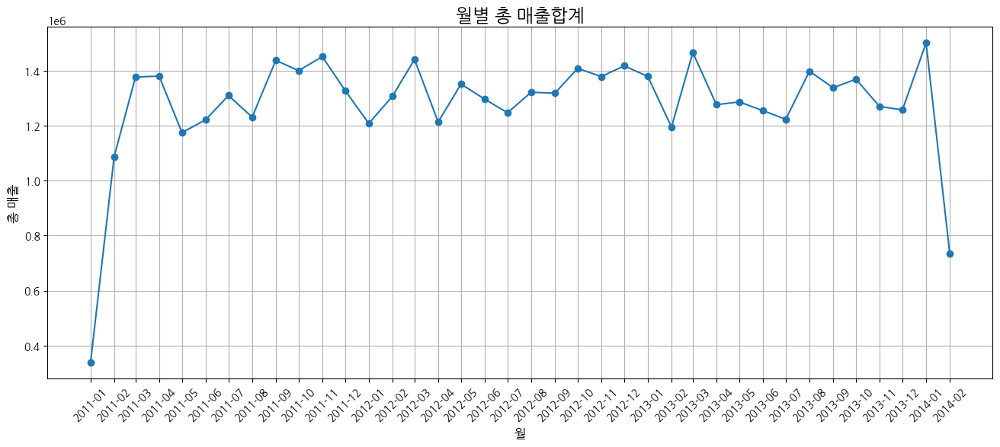

매출 관점에서 카테고리별 매출 성장 방안 분석
==============

요약
--------------------------------------
1. 기본 정보
- 개인 프로젝트(기여도 100%)
***
2. 프로젝트 진행 배경
- 그로스 해킹을 접하고 A/B테스트를 공부하게 되었습니다.
- 배운 지식을 내재화하고자 프로젝트를 진행하였습니다.
***

상세
--------
***
### 1. 문제 정의
- 2014년 2월의 총 매출액이 하락하여 기업에 큰 타격을 입었습니다. 
- 3월에 총 매출이 다시 인상하지 않으면 기업은 감당할 수 없는 위험이 다가올 것으로 보입니다. 
- 매출을 인상시키기 위해 카테고리별로 영향을 끼치는 요인을 찾아보고 분석하여 다음 달 매출을 증가시키기 위한 방안을 제안하기 위해 분석을 진행햇습니다.

***
### 2. 문제 인식
- 2014년 2월 총 매출이 2014년 1월 총 매출에 비해 50% 가까이 떨어진 것을 알 수 있습니다.

-------

### 3. EDA
- 
------ 

### 4. 가설 세우기
##### 1. 주문 후 환불을 하는 경우가 많아져서 매출이 감소하는 것이 아닐까?
  - 비교 지표 : 환불이 많이 일어나는 의류 vs 환불이 잘 안일어나는 전자기기
  - 관심 지표 : 환불율(환불 수량/주문 수량)
##### 2. 판매 체널에 영향을 많이 받는 카테고리가 존재하지 않을까?
  - 비교 지표 : 온라인 판매 채널 vs 오프라인 판매 채널
  - 관심 지표 : 카테고리별 판매 채널 환불 횟수 비율(카테고리별 판매 채널별 환불 횟수/카테고리별 판매 채널별 구매 횟수)
##### 3. 성별에 따라 선호하는 카테고리가 다르지 않을까?
  - 비교 지표 : 남성 vs 여성 
  - 관심 지표 : (성별에 따른 카테고리 구매 금액/카테고리별 총 구매 금액)
---------

### 5. 분석

----------

### 6. 결론

-----

### 7. 리뷰